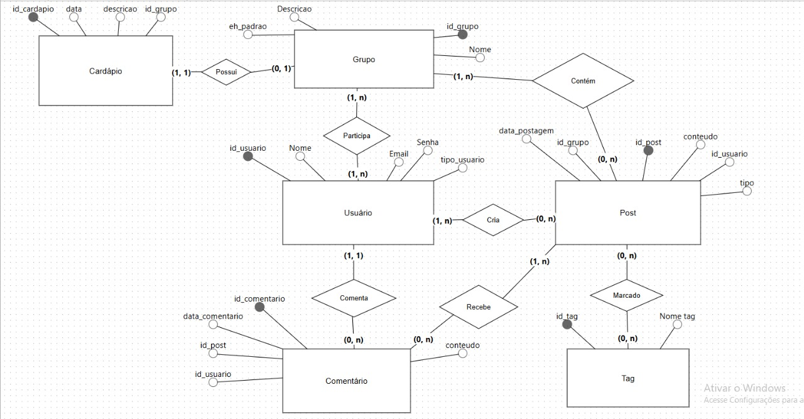

# 📘 Aplicativo Fatec Sorocaba

## 📌 Sobre o Projeto

O **Fatec APP** é uma solução digital desenvolvida na disciplina de **Engenharia de Software II**, sob a orientação do professor **Glauco Todesco**, com o objetivo de promover uma **comunicação integrada e dinâmica entre alunos, professores e setores da Fatec Sorocaba**.

Inspirado em plataformas como **Reddit** e **Discord**, o aplicativo oferece um ambiente interativo, leve e colaborativo, permitindo que os usuários **criem grupos, compartilhem avisos, interajam em chats temáticos**, participem de debates, encontrem informações acadêmicas e acompanhem atividades da instituição em tempo real.

---

## 🧩 Objetivo

Criar um espaço **colaborativo e acessível** que centralize a comunicação acadêmica informal da Fatec Sorocaba, facilitando a troca de informações sobre:

- Vagas de estágio  
- Monitorias  
- Eventos da Atlética  
- Avisos da cantina  
- Avisos de aula e comunicados internos  
- Bate-papos entre alunos por curso, semestre ou interesse  

---

## 🚀 Funcionalidades Principais

✅ **Sistema de Grupos Dinâmicos**  
Alunos podem participar de grupos fixos (como *Estágio*, *Atlética*, *Cantina*, *Monitoria*, *Avisos*) ou **criar seus próprios grupos**, como "1º semestre ADS 2025".

✅ **Postagens e Interação Estilo Reddit/Discord**  
Criação de posts com texto, menções, hashtags, curtidas e comentários.

✅ **Enquetes**  
Ferramenta para criar votações rápidas e obter opiniões da comunidade.

✅ **Chat de Vagas de Estágio**  
Espaço dedicado à divulgação de oportunidades, com links diretos e tags como "híbrido", "presencial", "noturno", etc.

✅ **Seção da Cantina**  
Cardápio diário atualizado, sugestões e promoções especiais.

✅ **Sistema de Monitorias**  
Organização por matéria e professor, com datas, horários e links (ex: Discord).

✅ **Perfis Personalizados**  
Usuários com identificação de curso, turno e tipo de participação (aluno, diretor, monitor etc.).

✅ **Filtros Inteligentes**  
Seleção de conteúdo por curso, semestre, turno e tema de interesse.

✅ **Responsividade**  
Interface adaptável a dispositivos móveis e desktops.

---

## 👤 Tipos de Usuários

- **🧑‍🎓 Alunos e Monitores**  
  Criam e participam de grupos, comentam em postagens, votam em enquetes, consultam oportunidades de estágio, acompanham o cardápio da cantina e interagem com outros usuários.  
  **❌ Não podem postar no grupo de "Avisos" oficiais.**

- **👩‍🏫 Professores e Diretores**  
  Têm acesso total à plataforma. Podem criar e compartilhar avisos oficiais, publicar mensagens em qualquer grupo (inclusive os de *Avisos*), divulgar oportunidades e interagir com todos os usuários.

- **👩‍🍳 Gestor da Cantina**  
  Responsável por atualizar o cardápio diariamente e publicar promoções. Também recebe sugestões e feedbacks dos alunos relacionados à sua área.  
  Possui as **mesmas funcionalidades dos alunos**, com acesso exclusivo à área da cantina.

---

## 🏗 Tecnologias Utilizadas

- **Frontend:** HTML, CSS, Bootstrap, React, JavaScript.
- **Backend:** Python, Django.
- **Banco de Dados:** MySQL.
- **Mobile (Android/iOS):** Expo.
- **Outras Tecnologias:** Chatbot AI, Google Docs.

## Personas do Projeto

Google Docs: <a href="https://docs.google.com/document/d/1_01-EpSqdp3gk0NmYZeFwYTBE9Kx08mUzxZCjFpy08Y/edit?tab=t.0">Personas</a>

## Histórias de Usuário
Google Docs: <a href="https://docs.google.com/document/d/1DoA_hFs1l1k52NsO2YDXHz2OvN5ucYaGdeDOLYP74Ew/edit?tab=t.0">User Storys</a>

## Monetização do Projeto
Google Docs: <a href="https://docs.google.com/document/d/1MLYONQXhkHOfNVfM0XUEV9lFHRSZDZwSH02b0m-d8GQ/edit?tab=t.0">Monetização</a>

---

## Protótipo do Projeto:

Canva: <a href="https://www.canva.com/design/DAGjTevIkFM/KqzIxAOAh1b6EJMCWWi4Eg/edit?utm_content=DAGjTevIkFM&utm_campaign=designshare&utm_medium=link2&utm_source=sharebutton">
Protótipo</a>

---
## Link do vídeo:

Vídeo: https://vimeo.com/1079173650

---
## Modelo entidade relacionamento

---
## Modelo Conceitual (Classes)

---
**Desenvolvido por:**
- Drkaesp | Miguel Scomparin
- NicolasGimenezAlcalde | Nicolas Gimenez
- RafaelDiasCmp | Rafael Dias

Com certeza. Preparei o código completo no formato PlantUML, que é uma linguagem padrão para gerar diagramas a partir de texto.
Você pode copiar e colar este código em um editor online que suporte PlantUML (como o site oficial do PlantUML, Lucidchart, ou a integração do draw.io) para visualizar e exportar o modelo conceitual que desenvolvemos.
Aqui está o código:
@startuml
' Definição de Estilo para Melhor Leitura
skinparam classAttributeIconSize 0
hide empty members

' --- CLASSES CENTRAIS E HIERARQUIAS ---

abstract class Usuario {
  -idUsuario: int {PK}
  -nome: string
  -email: string {unique}
  -senhaHash: string
  -fotoPerfilURL: string
  #cargo: Enum
  +login(email: string, senha: string): bool
  +logout(): void
  +editarPerfil(dados: map): bool
  +criarGrupo(nome: string, desc: string): Grupo
  +seguirGrupo(grupo: Grupo): void
}

class Aluno extends Usuario {
  -curso: string
  -semestre: int
  -periodo: Enum
  +buscarVagaEstagio(filtros: map): VagaEstagio
  +responderEnquete(enquete: Enquete, opcao: string): void
}

class Professor extends Usuario {
  -departamento: string
  +postarAviso(grupo: Grupo, aviso: Aviso): bool
}

class DiretorCantina extends Usuario {
  +atualizarCardapio(cardapio: Cardapio): bool
  +adicionarItemCardapio(item: ItemCardapio): bool
  +removerItemCardapio(item: ItemCardapio): bool
}

class DiretorAtletica extends Usuario {
  +criarEvento(postagem: Postagem): bool
}

abstract class Postagem {
  -idPostagem: int {PK}
  #texto: string
  #dataHora: datetime
  #isImportante: bool
  +adicionarComentario(comentario: Comentario): void
  +getComentarios(): Comentario
}

class Aviso extends Postagem {
}

class VagaEstagio extends Postagem {
  -titulo: string
  -empresa: string
  -localizacao: string
  -modalidade: Enum
  -linkExterno: string
}

class Enquete extends Postagem {
  -titulo: string
  -opcoes: Map<string, int>
  -dataFim: datetime
  +votar(opcao: string): void
}

' --- OUTRAS CLASSES PRINCIPAIS ---

class Perfil {
  ' Atributos podem ser derivados do usuário ou específicos do perfil
  ' como biografia, lista de posts, etc.
}

class Grupo {
  -idGrupo: int {PK}
  -nome: string {unique}
  -descricao: string
  -dataCriacao: datetime
  +adicionarMembro(usuario: Usuario): void
  +removerMembro(usuario: Usuario): void
  +getPostagens(): Postagem
}

class Comentario {
  -idComentario: int {PK}
  -texto: string
  -dataHora: datetime
}

class Tag {
  -idTag: int {PK}
  -nome: string {unique}
}

class Notificacao {
    -idNotificacao: int {PK}
    -texto: string
    -dataHora: datetime
    -lida: bool
}

class Cardapio {
  -idCardapio: int {PK}
  -dataVigencia: date
  +getItens(): ItemCardapio
}

class ItemCardapio {
  -idItem: int {PK}
  -nome: string
  -preco: decimal
  -categoria: Enum
}

' --- RELACIONAMENTOS E MULTIPLICIDADE ---

' Composição (Ciclo de vida dependente - Losango Preenchido)
Usuario "1" *-- "1" Perfil
Postagem "1" *-- "0..*" Comentario
Cardapio "1" *-- "1..*" ItemCardapio

' Agregação (Parte de, mas com ciclo de vida independente - Losango Vazio)
Grupo "1" o-- "0..*" Usuario : "membros >"

' Associações Direcionadas e Bidirecionais
Usuario "1" --> "0..*" Postagem : "autor"
Grupo "1" --> "0..*" Postagem : "contém"
Usuario "1" --> "0..*" Notificacao : "recebe"
DiretorCantina "1" --> "1" Cardapio : "gerencia"

' Associação Muitos-para-Muitos
Postagem "0..*" -- "0..*" Tag
note on link: Na implementação, isso se torna uma tabela de junção (Postagem_Tag).

Usuario "0..*" -- "0..*" Grupo : "segue"
note on link: Relação de seguir, distinta de ser membro.

' Associação de Resposta (Auto-relacionamento)
Comentario "1" -- "0..1" Comentario : "responde a >"

@enduml

